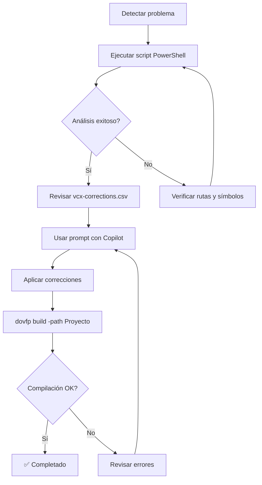

# 🔧 Prompts de Refactorización

Esta carpeta contiene prompts especializados para refactorización de código Visual FoxPro 9.

## 📚 Prompts Disponibles

### 1. `refactor-patterns.prompt.md`
Catálogo de patrones de refactorización para modernizar código VFP legacy.

**Uso**: `@workspace #prompt:refactor-patterns`

---

### 2. `fix-vcx-loadreference.prompt.md` 🆕
**Corrección automática de referencias LoadReference para clases VCX**

Corrige masivamente las referencias `_screen._instanceFactory.LoadReference()` validando contra archivos de símbolos DOVFP.

**✨ Completamente autocontenido**: Solo necesitas el archivo `.prompt.md`. El script PowerShell está incluido inline.

#### 🎯 Cuándo usar
- Tienes múltiples archivos `.prg` que heredan de clases `.vcx`
- Las referencias LoadReference apuntan a apps incorrectas
- Acabas de reorganizar VCX entre diferentes APPs
- Migraste VCX de un proyecto a otro

#### 🚀 Cómo usar

1. Invoca el prompt: `@workspace #prompt:fix-vcx-loadreference`
2. Personaliza con tus rutas y apps
3. Copilot creará el script, lo ejecutará, y aplicará las correcciones
4. Los archivos temporales se limpian automáticamente

#### 📝 Ejemplo de uso

```markdown
@workspace #prompt:fix-vcx-loadreference

Necesito corregir las referencias LoadReference en:
- Ruta: Organic.Generated/Generados
- Símbolos: Organic.BusinessLogic/packages/Exe
- Apps: Core, Drawing, Feline

Sigue el proceso completo del prompt.
```

#### ✅ Resultado esperado
- ✅ Todos los archivos con referencias correctas según símbolos
- ✅ VCX locales sin LoadReference innecesario
- ✅ Reporte de VCX no encontrados para revisión manual
- ✅ Proyecto compilando sin errores

---

## 🔄 Workflow Recomendado

### Para Correcciones VCX LoadReference



### Pasos detallados:

1. **Preparación**
   ```powershell
   # Asegurarse que símbolos están actualizados
   dovfp restore
   dovfp build -path Organic.BusinessLogic
   ```

2. **Análisis**
   ```powershell
   # Ejecutar script de análisis
   .\fix-vcx-loadreference.ps1 -SourcePath "..." -SymbolsPath "..."
   ```

3. **Corrección** (con Copilot)
   ```markdown
   Usando el mapeo generado en vcx-mapeo.json, corrige las referencias
   LoadReference en todos los archivos listados en vcx-corrections.csv
   ```

4. **Validación**
   ```powershell
   # Compilar
   dovfp build -path Organic.BusinessLogic
   
   # Verificar errores
   Get-Content .\obj\Exe\*.err
   ```

5. **Commit**
   ```bash
   git add .
   git commit -m "fix: Corregir referencias VCX LoadReference según símbolos"
   ```

---

## 🎨 Personalización

### Adaptar a otro workspace

1. **Copiar archivos**:
   ```powershell
   Copy-Item "fix-vcx-loadreference.*" -Destination "C:\otro\proyecto\.github\prompts\refactor\"
   ```

2. **Modificar rutas** en el prompt:
   ```markdown
   - Ubicación archivos: [TU_RUTA_AQUÍ]
   - Ubicación símbolos: [TU_RUTA_SIMBOLOS]
   ```

3. **Ajustar apps** si usas nombres diferentes:
   ```powershell
   -Apps @("MiApp.Core", "MiApp.UI", "MiApp.Business")
   ```

### Variables configurables

En `fix-vcx-loadreference.ps1`:

```powershell
param(
    [string]$SourcePath,      # Dónde buscar archivos .prg
    [string]$SymbolsPath,     # Dónde están los .symbols
    [string]$FilePattern,     # Patrón de archivo (default: *.prg)
    [string[]]$Apps           # Lista de apps a buscar
)
```

---

## 📊 Métricas de Éxito

Después de aplicar el prompt, verifica:

- ✅ **Cobertura**: 100% de archivos VCX procesados
- ✅ **Corrección**: 0 referencias incorrectas
- ✅ **Compilación**: Sin errores en archivos modificados
- ✅ **Documentación**: Lista clara de casos no resueltos

---

## 🐛 Troubleshooting

### "No se encontraron archivos con patrón VCX"
- Verifica que `$SourcePath` sea correcto
- Asegúrate que hay archivos `.prg` con `define class X as Y of Z.vcx`

### "Todos los VCX muestran NO_ENCONTRADO"
- Verifica que `$SymbolsPath` sea correcto
- Ejecuta `dovfp restore` y `dovfp build` para regenerar símbolos
- Asegúrate que DOVFP esté actualizado (símbolos VCX desde versión X.X)

### "Compilación falla después de correcciones"
- Revisa `obj\Exe\*.err` para ver errores específicos
- Verifica que no hayas eliminado LoadReference de VCX externos
- Confirma que las apps referenciadas existen en packages/Exe/

---

## 📚 Referencias

- [DOVFP Documentation](https://github.com/...)
- [Symbols Format](../../instructions/dovfp-build.instructions.md)
- [VFP Development Guide](../../instructions/vfp-development.instructions.md)

---

## 🏷️ Mantenimiento

**Última actualización**: 2025-10-23  
**Versión**: 1.0  
**Responsable**: AI Assistant + Usuario  
**Estado**: ✅ Activo
